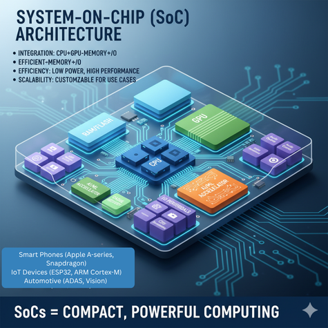
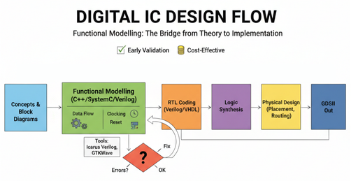
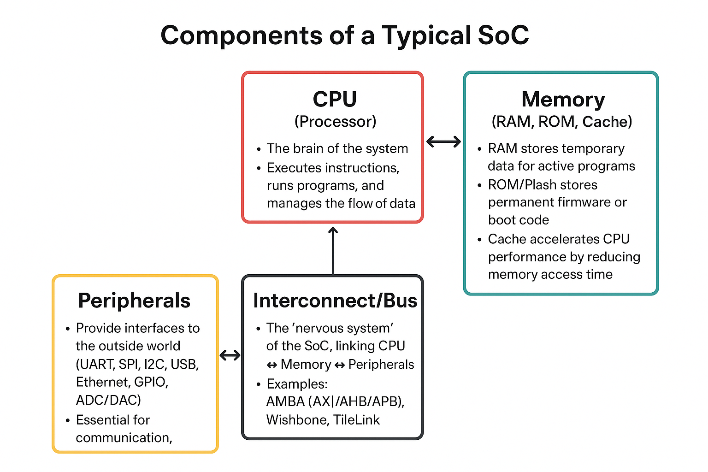
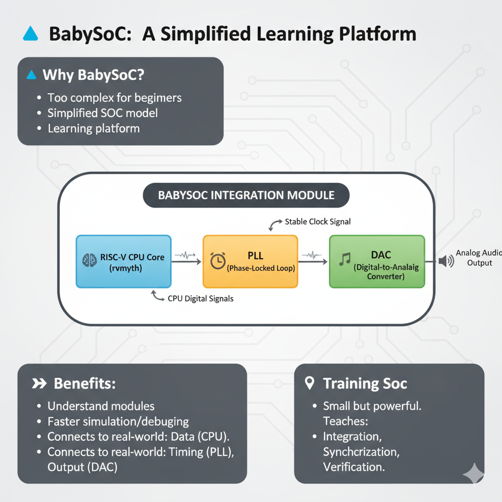

# 🍼 Week 2 – BabySoC Fundamentals & Functional Modelling

## 🎯 Objective

To build a **solid understanding of SoC fundamentals** and practice **functional modelling** of the BabySoC using open-source simulation tools (**Icarus Verilog & GTKWave**).

This week bridges the gap between **conceptual theory** and **practical simulation**, ensuring we are equipped with both **system-level knowledge** and the **hands-on ability** to validate our designs.

---

## 📘 Part 1 – Theory (Conceptual Understanding)

### 🔹 What is a System-on-Chip (SoC)?

A **System-on-Chip (SoC)** is a highly integrated circuit that combines the major building blocks of a computer system onto a **single piece of silicon**. Instead of having separate chips for the processor, memory, and peripherals, an SoC places everything on one die.

Key points:

* **Integration:** CPU, memory, and I/O peripherals are merged onto one chip.
* **Efficiency:** High performance with lower power consumption compared to multi-chip solutions.
* **Scalability:** SoCs are tailored for specific use cases – from mobile devices to servers.

📱 **Real-life Examples:**

* Smartphones use SoCs like **Qualcomm Snapdragon** or **Apple A-series chips**.
* IoT devices use lightweight SoCs like **ESP32** or **ARM Cortex-M series**.
* Automotive systems use specialized SoCs for ADAS, vision, and sensor fusion.

👉 In short, **SoCs = compact systems** that provide powerful computing with minimal hardware overhead.

---

### 🔹 Components of a Typical SoC

Every SoC is designed around a few **core components** that interact seamlessly:

1. **CPU (Processor):**

   * The **brain of the system**, executes instructions, runs programs, and manages the flow of data.
   * Can be simple (microcontroller-class cores like ARM Cortex-M0, RISC-V RV32I) or complex (multi-core ARM Cortex-A series, x86 cores).

2. **Memory (RAM, ROM, Cache):**

   * RAM stores temporary data for active programs.
   * ROM/Flash stores permanent firmware or boot code.
   * Cache accelerates CPU performance by reducing memory access time.

3. **Peripherals:**

   * Provide **interfaces** to the outside world (UART, SPI, I2C, USB, Ethernet, GPIO, ADC/DAC).
   * Essential for communication, sensing, and control in embedded systems.

4. **Interconnect/Bus:**

   * The “nervous system” of the SoC, linking CPU ↔ Memory ↔ Peripherals.
   * Examples: **AMBA (AXI/AHB/APB)**, **Wishbone**, **TileLink**.

📌 Together, these components form a **self-sufficient computing platform**.

---

### 🔹 Why BabySoC?

Designing an industrial-grade SoC is **too complex** for beginners, so we use a **simplified SoC model** – the **BabySoC** – as a learning platform.

The BabySoC integrates **just three essential modules**:

* 🧠 **RISC-V CPU core (rvmyth)** – executes basic instructions.
* ⏱ **PLL (Phase-Locked Loop)** – generates stable clock signals.
* 🎵 **DAC (Digital-to-Analog Converter)** – converts CPU-generated digital signals into analog outputs.

👉 Benefits of BabySoC:

* Simple enough to **understand each module in depth**.
* Small scale means **faster simulation and debugging**.
* Directly connects to **real-world concepts**: data generation (CPU), timing (PLL), and output (DAC).

📌 Think of it as a **training SoC** – small but powerful enough to teach you the principles of **integration, synchronization, and verification**.

---

### 🔹 Role of Functional Modelling

Before diving into RTL coding and full physical design, **functional modelling** ensures the **system works logically**.

**What is functional modelling?**

* It is the process of **simulating the SoC at a higher level** to check correctness of behavior.
* Instead of transistors or layouts, we test **functionality and data flow**.

**Why is it important?**

* 🛠 **Early validation:** Catch logical errors before spending effort on RTL and synthesis.
* ⏱ **Clocking & Reset checks:** Ensures PLL provides proper timing and reset initializes the system.
* 🔄 **Data movement verification:** CPU → DAC transfer should be correct.
* 💸 **Cost-effective:** Fixing errors early avoids expensive re-design in later GDSII stages.

📊 **Design flow visualization:**

**Tools used:**

* **Icarus Verilog (iverilog):** Open-source simulator for compiling and running Verilog models.
* **GTKWave:** Waveform viewer to inspect signals, timing, and data paths.

This step acts as a **bridge** between **theory** (block diagrams, concepts) and **hands-on RTL design**.

---

## 📄 Deliverable (This Week)

This week’s write-up (Part 1) covers:

* ✅ What an SoC is, with real-world relevance.
* ✅ Breakdown of SoC components and their role.
* ✅ BabySoC’s simplified structure and purpose.
* ✅ Importance of functional modelling in the design cycle.

➡️ **Next (Part 2):** Practical lab work –

* Simulating BabySoC functional model in **Icarus Verilog**.
* Viewing waveforms in **GTKWave**.
* Documenting test results and observations.

---

## 📌 Key Takeaway

The **BabySoC project** provides a **stepping stone** into the world of semiconductor design. By first mastering **functional modelling**, we ensure that later stages of **RTL, synthesis, and layout** are built on a **robust and error-free foundation**.

---
